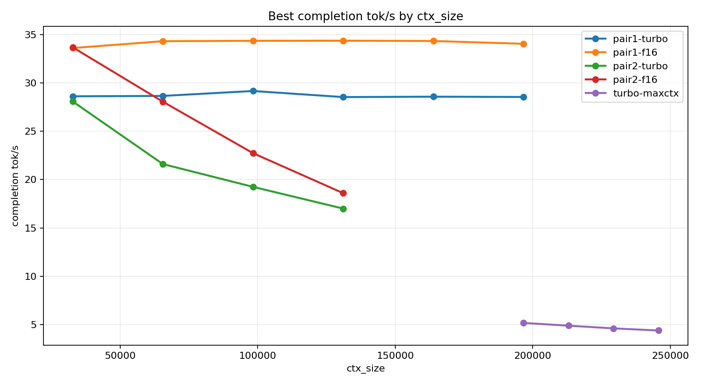
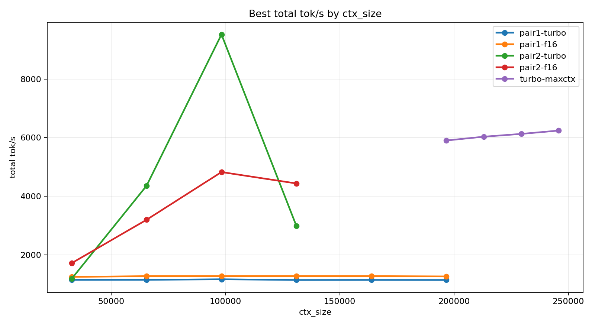
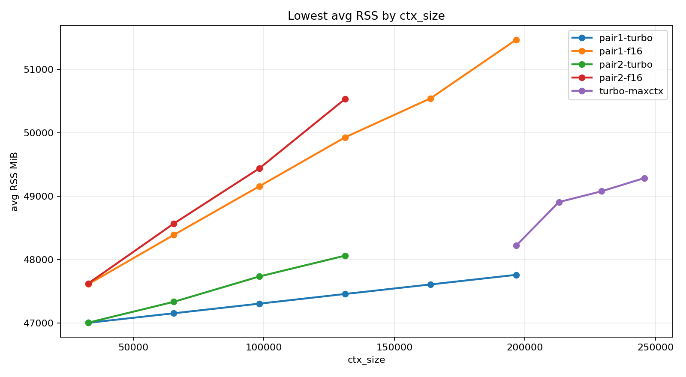
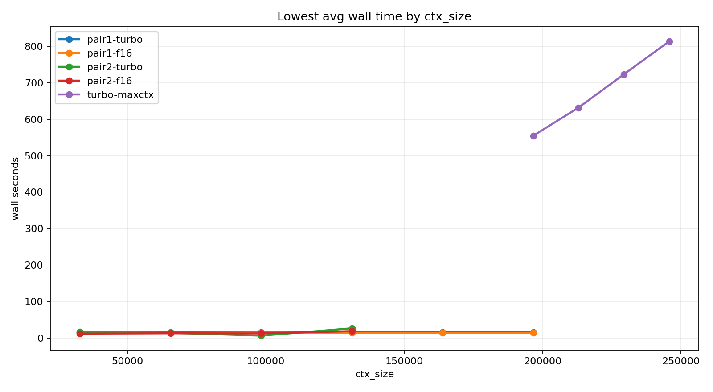

# Aggregate Tuning Plots

## Included series

- `pair1-turbo`: `/Users/yoda/code/projects/llama-server-tuning/results/apple-silicon/turbo-20260403-130143/turbo-summary.tsv`
- `pair1-f16`: `/Users/yoda/code/projects/llama-server-tuning/results/apple-silicon/f16-20260403-120306/f16-summary.tsv`
- `pair2-turbo`: `/Users/yoda/code/projects/llama-server-tuning/results/apple-silicon/turbo-20260403-153548/turbo-summary.tsv`
- `pair2-f16`: `/Users/yoda/code/projects/llama-server-tuning/results/apple-silicon/f16-20260403-140703/f16-summary.tsv`
- `turbo-maxctx`: `/Users/yoda/code/projects/llama-server-tuning/results/apple-silicon/turbo-maxctx-20260403-165708/turbo-maxctx-summary.tsv`

## Generated plots

- 
- 
- 
- 
