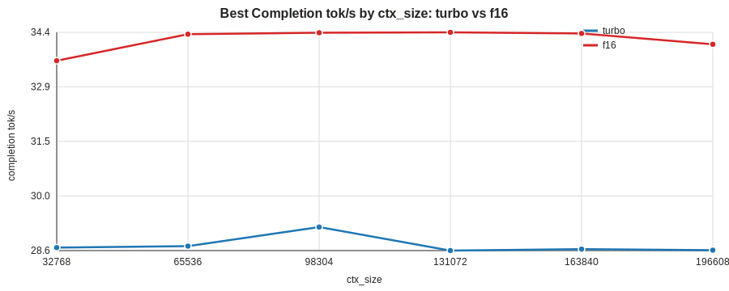
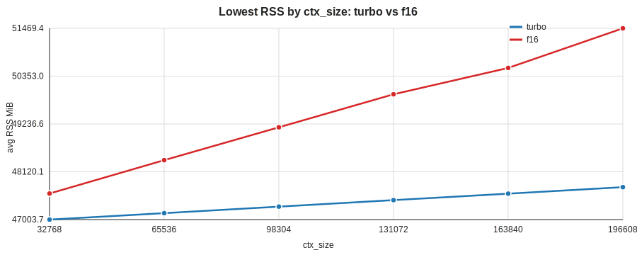

# Tuning Graph Comparison: turbo vs f16

## Best Completion tok/s By ctx_size

## Lowest RSS By ctx_size

## Best-speed Rows

| label | ctx | batch | ubatch | completion tok/s | total tok/s | avg RSS MiB |
|---|---:|---:|---:|---:|---:|---:|
| turbo | 32768 | 512 | 128 | 28.63 | 1146.40 | 47006.0 |
| turbo | 65536 | 1024 | 128 | 28.67 | 1148.18 | 47154.2 |
| turbo | 98304 | 1024 | 128 | 29.18 | 1168.02 | 47306.0 |
| turbo | 131072 | 1024 | 128 | 28.55 | 1143.12 | 47458.3 |
| turbo | 163840 | 1024 | 128 | 28.59 | 1144.78 | 47609.0 |
| turbo | 196608 | 512 | 128 | 28.56 | 1143.32 | 47763.3 |
| f16 | 32768 | 1024 | 128 | 33.63 | 1248.31 | 47624.8 |
| f16 | 65536 | 1024 | 128 | 34.34 | 1274.77 | 48391.0 |
| f16 | 98304 | 1024 | 128 | 34.38 | 1276.46 | 49160.5 |
| f16 | 131072 | 1024 | 128 | 34.39 | 1277.17 | 49928.8 |
| f16 | 163840 | 512 | 128 | 34.36 | 1275.78 | 50702.4 |
| f16 | 196608 | 1024 | 128 | 34.07 | 1264.99 | 51469.4 |

## Lowest-memory Rows

| label | ctx | batch | ubatch | avg RSS MiB | peak RSS MiB | completion tok/s |
|---|---:|---:|---:|---:|---:|---:|
| turbo | 32768 | 1024 | 128 | 47003.7 | 47003.9 | 28.58 |
| turbo | 65536 | 1024 | 128 | 47154.2 | 47154.4 | 28.67 |
| turbo | 98304 | 512 | 128 | 47305.9 | 47307.0 | 28.59 |
| turbo | 131072 | 1024 | 128 | 47458.3 | 47458.5 | 28.55 |
| turbo | 163840 | 1024 | 128 | 47609.0 | 47609.5 | 28.59 |
| turbo | 196608 | 1024 | 128 | 47760.4 | 47760.7 | 28.54 |
| f16 | 32768 | 512 | 128 | 47612.7 | 47613.0 | 33.32 |
| f16 | 65536 | 1024 | 128 | 48391.0 | 48391.1 | 34.34 |
| f16 | 98304 | 512 | 128 | 49158.2 | 49158.4 | 34.37 |
| f16 | 131072 | 1024 | 128 | 49928.8 | 49929.0 | 34.39 |
| f16 | 163840 | 1024 | 128 | 50544.9 | 50546.5 | 34.02 |
| f16 | 196608 | 1024 | 128 | 51469.4 | 51469.6 | 34.07 |
