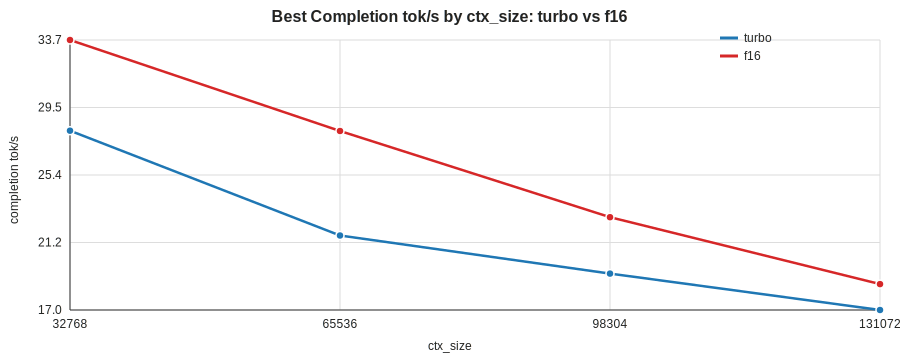
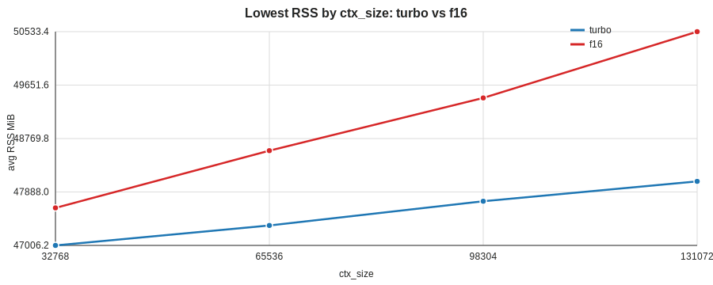

# Tuning Graph Comparison: turbo vs f16

## Best Completion tok/s By ctx_size

## Lowest RSS By ctx_size

## Best-speed Rows

| label | ctx | batch | ubatch | completion tok/s | total tok/s | avg RSS MiB |
|---|---:|---:|---:|---:|---:|---:|
| turbo | 32768 | 1024 | 128 | 28.09 | 1181.10 | 47007.1 |
| turbo | 65536 | 512 | 128 | 21.61 | 4356.56 | 47335.1 |
| turbo | 98304 | 512 | 128 | 19.25 | 3588.14 | 47734.8 |
| turbo | 131072 | 512 | 128 | 17.00 | 2985.84 | 48075.7 |
| f16 | 32768 | 1024 | 128 | 33.70 | 1716.08 | 47629.1 |
| f16 | 65536 | 1024 | 128 | 28.07 | 3196.64 | 48578.1 |
| f16 | 98304 | 1024 | 128 | 22.74 | 4824.57 | 49587.8 |
| f16 | 131072 | 512 | 128 | 18.60 | 4434.15 | 50533.6 |

## Lowest-memory Rows

| label | ctx | batch | ubatch | avg RSS MiB | peak RSS MiB | completion tok/s |
|---|---:|---:|---:|---:|---:|---:|
| turbo | 32768 | 512 | 128 | 47006.2 | 47006.4 | 27.95 |
| turbo | 65536 | 512 | 128 | 47335.1 | 47335.5 | 21.61 |
| turbo | 98304 | 512 | 128 | 47734.8 | 47735.3 | 19.25 |
| turbo | 131072 | 1024 | 128 | 48062.6 | 48063.3 | 17.00 |
| f16 | 32768 | 512 | 128 | 47625.4 | 47625.8 | 33.47 |
| f16 | 65536 | 512 | 128 | 48569.4 | 48569.8 | 28.04 |
| f16 | 98304 | 1024 | 256 | 49440.6 | 49442.2 | 20.65 |
| f16 | 131072 | 1024 | 128 | 50533.4 | 50534.3 | 18.60 |
